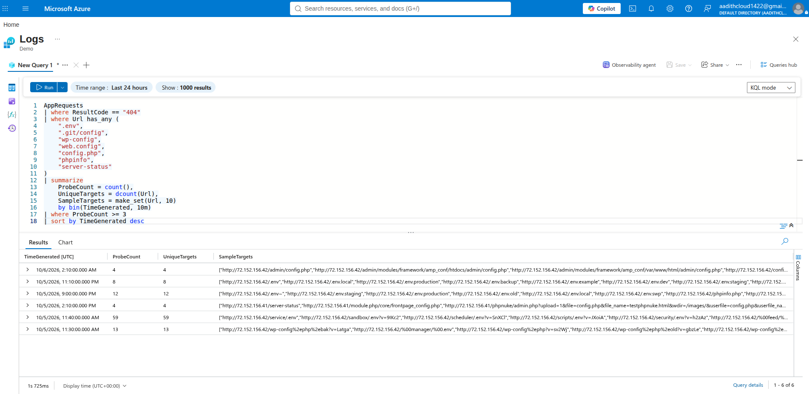
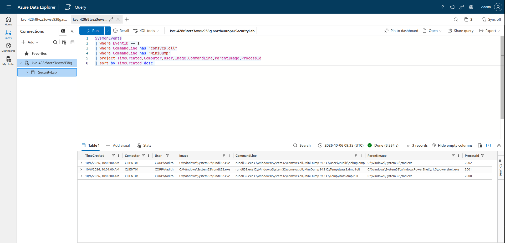
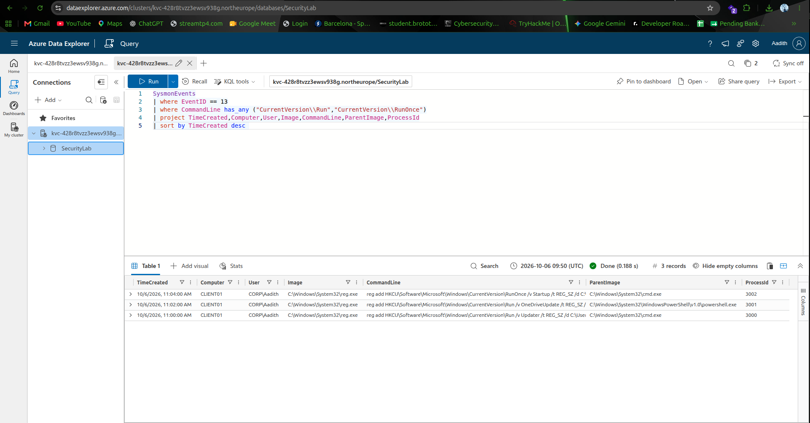
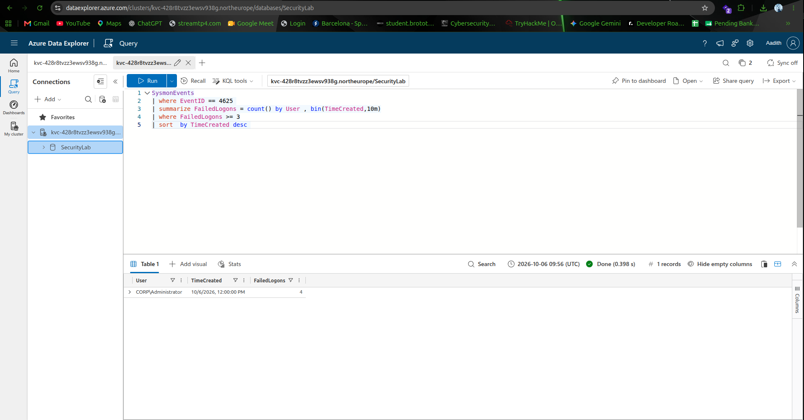

# KQL Detection Engineering Lab

A hands-on SOC detection engineering project focused on building,
testing, validating, and documenting security detections using
Kusto Query Language (KQL).

The project uses Azure Data Explorer as the KQL analysis environment
and uses simulated security telemetry to develop practical SOC
detections mapped to the MITRE ATT&CK framework.

---

## Project Overview

Detection engineering is the process of identifying suspicious
security behavior and converting that behavior into reliable,
investigable detection logic.

This project demonstrates the complete detection engineering workflow:

1. Identify suspicious behavior
2. Identify the required telemetry
3. Write the KQL detection
4. Test the query against security telemetry
5. Validate the detection results
6. Define thresholds where required
7. Review false positives
8. Map the detection to MITRE ATT&CK
9. Document investigation steps
10. Define an appropriate response

---

## Objectives

The main objectives of this project are:

- Learn and practice Kusto Query Language (KQL)
- Understand security telemetry and event fields
- Build practical SOC detection rules
- Detect suspicious Windows and web activity
- Map detections to MITRE ATT&CK
- Validate detections using simulated telemetry
- Understand detection thresholds
- Identify potential false positives
- Document investigation and response procedures
- Build a portfolio project demonstrating detection engineering skills

---

## Technologies Used

- Kusto Query Language (KQL)
- Azure Data Explorer
- Sysmon
- Windows Event Logs
- Application Insights / AppRequests
- MITRE ATT&CK
- Linux
- Git

---

## Architecture

```text
                 Security Telemetry
                        |
          +-------------+-------------+
          |                           |
          v                           v
   Application Logs             Windows Telemetry
     AppRequests                  Sysmon / Event Logs
          |                           |
          +-------------+-------------+
                        |
                        v
              Azure Data Explorer
                        |
                        v
                       KQL
                        |
                        v
                Detection Logic
                        |
          +-------------+-------------+
          |                           |
          v                           v
   MITRE ATT&CK Mapping        Investigation
                                      |
                                      v
                                  Response
```

---

# Detection Coverage

The project currently contains four security detections.

| # | Detection | Data Source | Event / Table | MITRE ATT&CK |
|---|---|---|---|---|
| 01 | Sensitive File Web Reconnaissance | Application telemetry | AppRequests | T1595 |
| 02 | LSASS Credential Dumping | Sysmon | Event ID 1 | T1003.001 |
| 03 | Registry Run Keys Persistence | Sysmon | Event ID 13 | T1547.001 |
| 04 | Windows Brute Force | Windows telemetry | Event ID 4625 | T1110 |

---

# Detection 01 - Sensitive File Web Reconnaissance

## Objective

Detect repeated HTTP requests for sensitive configuration,
environment, and administrative files that may indicate web
reconnaissance or automated scanning.

## Data Source

`AppRequests`

## MITRE ATT&CK

**T1595 - Active Scanning**

## Detection Logic

The detection looks for HTTP `404` responses targeting
sensitive file and administrative paths.

Events are grouped into 10-minute windows.

An alert is generated when 3 or more matching probes occur
within the same window.

## Sensitive Targets

The detection searches for requests containing:

- `.env`
- `.git/config`
- `wp-config`
- `web.config`
- `config.php`
- `phpinfo`
- `server-status`

## Threshold

**3 or more probes within 10 minutes.**

This threshold is an initial baseline derived from the
Microsoft Log Analytics demo environment and should be
tuned against normal production traffic.

## Validation

The detection produced 6 matching time windows in the
observed demo dataset.

The highest observed window contained:

- 59 probes
- 59 unique targets

## Investigation

When an alert fires, investigate:

1. Requested URLs
2. Number of unique targets
3. Time window
4. Client IP, if reliable
5. User identity, if available
6. User agent
7. Whether the requested files exist
8. Whether successful responses followed the reconnaissance

## Response

If malicious activity is confirmed:

1. Identify the source
2. Determine whether sensitive files were successfully accessed
3. Check for additional reconnaissance or exploitation
4. Block or contain the source where appropriate
5. Investigate related application logs

---

# Detection 02 - LSASS Credential Dumping

## Objective

Detect process creation activity that may indicate an attempt
to dump LSASS memory using the `comsvcs.dll` MiniDump technique.

## Data Source

Sysmon Event ID 1 - Process Creation

## MITRE ATT&CK

**T1003.001 - LSASS Memory**

## Detection Logic

The detection searches process creation events for a command line
containing both:

- `comsvcs.dll`
- `MiniDump`

The observed activity uses `rundll32.exe` to invoke
`comsvcs.dll`.

## Detection Pattern

```text
rundll32.exe
      |
      v
comsvcs.dll
      |
      v
MiniDump
      |
      v
LSASS memory dump
```

## Threshold

Any matching process creation event generates a detection.

## Validation

The detection produced 3 matching events in the simulated
Sysmon dataset.

The detected activity included:

- `rundll32.exe`
- `comsvcs.dll`
- `MiniDump`

Parent processes included:

- `cmd.exe`
- PowerShell

## Investigation

When an alert fires, investigate:

1. Process image
2. Command line
3. Parent process
4. User identity
5. Process ID
6. Dump file path, if available
7. Whether the activity was authorized

## Response

If malicious activity is confirmed:

1. Isolate the affected endpoint
2. Investigate for credential theft
3. Check for additional suspicious processes
4. Review for lateral movement
5. Reset potentially compromised credentials
6. Investigate related persistence or execution activity

---

# Detection 03 - Registry Run Keys Persistence

## Objective

Detect modifications to Windows Registry locations that may
be used to establish persistence.

## Data Source

Sysmon Event ID 13 - Registry Value Set

## MITRE ATT&CK

**T1547.001 - Registry Run Keys / Startup Folder**

## Detection Logic

The detection searches for Registry modifications involving
common Windows `Run` and `RunOnce` locations.

## Persistence Locations

```text
CurrentVersion\Run
CurrentVersion\RunOnce
```

## Threshold

Any matching Registry modification generates a detection.

## Validation

The detection produced 3 matching events in the simulated
Sysmon dataset.

The detected events modified:

- `CurrentVersion\Run`
- `CurrentVersion\RunOnce`

## Investigation

When an alert fires, investigate:

1. Registry path
2. Registry value
3. Executable path
4. User identity
5. Parent process
6. Process command line
7. Whether the referenced executable is legitimate

## Response

If malicious activity is confirmed:

1. Identify the persistence mechanism
2. Remove or disable the malicious Registry entry
3. Investigate the referenced executable
4. Check for additional persistence mechanisms
5. Review the endpoint for related malicious activity

---

# Detection 04 - Windows Brute Force

## Objective

Detect repeated failed Windows logon attempts that may
indicate brute-force activity.

## Data Source

Windows Event ID 4625 - Failed Logon

## MITRE ATT&CK

**T1110 - Brute Force**

## Detection Logic

The detection counts failed logon events for each user.

The events are grouped into 10-minute windows.

An alert is generated when 3 or more failed logons occur
for the same user within the same window.

## Threshold

**3 or more failed logons within 10 minutes.**

This threshold is an initial baseline for the simulated
lab dataset and should be tuned against normal authentication
activity in a production environment.

## Validation

The detection produced 1 matching time window in the
simulated dataset.

The detected window contained:

- User: `CORP\Administrator`
- 4 failed logons

A single failed logon for `CORP\Aadith` was not detected
because it did not reach the threshold.

## Investigation

When an alert fires, investigate:

1. Username
2. Number of failed attempts
3. Time window
4. Source information, if available
5. Successful logons following the failures
6. Whether the account activity is expected

## Response

If brute-force activity is confirmed:

1. Identify the source
2. Check whether the account was successfully compromised
3. Investigate successful authentication events
4. Block or restrict the source where appropriate
5. Reset compromised credentials
6. Review the account and endpoint for further activity

---

# Detection Validation

The following screenshots provide evidence of query execution and
detection validation in Azure Data Explorer.

## Detection 01 - Sensitive File Web Reconnaissance



## Detection 02 - LSASS Credential Dumping



## Detection 03 - Registry Persistence



## Detection 04 - Windows Brute Force



---

# Detection Engineering Methodology

Each detection follows the same development process.

```text
                 Identify Threat Behavior
                           |
                           v
                 Identify Required Telemetry
                           |
                           v
                     Write KQL Query
                           |
                           v
                     Test the Query
                           |
                           v
                   Validate Results
                           |
                           v
                 Tune Detection Logic
                           |
                           v
                 Review False Positives
                           |
                           v
                 Map to MITRE ATT&CK
                           |
                           v
                  Document Detection
                           |
                           v
                Define Investigation
                           |
                           v
                     Define Response
```

---

# KQL Concepts Practiced

The project provides practical experience with several
important KQL operators and concepts.

## Filtering

```kql
where
```

Used to select relevant security events.

## Selecting Fields

```kql
project
```

Used to display only the fields required for investigation.

## String Matching

```kql
has
has_any
```

Used to search command lines, URLs, and other text fields.

## Counting Events

```kql
count()
```

Used to determine the number of matching events.

## Time-Based Grouping

```kql
bin(TimeCreated, 10m)
```

Used to group events into time windows.

## Aggregation

```kql
summarize
```

Used to calculate event counts and other statistics.

## Sorting

```kql
sort by TimeCreated desc
```

Used to display the newest events first.

These operators form the foundation of the detection queries
used in this project.

---

# False Positive Handling

Detection engineering is not only about detecting malicious
activity. A useful detection should also consider legitimate
activity.

Potential false-positive sources across the project include:

- Authorized security testing
- Vulnerability scanners
- Administrative activity
- Software installation
- Application updates
- Incident response
- Debugging
- Users entering incorrect passwords
- Service account configuration problems
- Enterprise software deployment

Detection thresholds should therefore be tuned against
normal activity in the environment where the detection
will be deployed.

---

# Validation Approach

The detections were tested using simulated security telemetry
ingested into Azure Data Explorer.

Validation included:

- Executing KQL queries against the telemetry
- Confirming expected events were returned
- Reviewing command-line information
- Reviewing parent-child process relationships
- Reviewing Registry paths
- Testing failed-logon thresholds
- Checking whether benign events were excluded
- Documenting detection results
- Recording potential false positives

---

# MITRE ATT&CK Coverage

The project currently covers the following techniques:

| Technique | Name | Detection |
|---|---|---|
| T1595 | Active Scanning | Sensitive File Web Reconnaissance |
| T1003.001 | LSASS Memory | LSASS Credential Dumping |
| T1547.001 | Registry Run Keys / Startup Folder | Registry Persistence |
| T1110 | Brute Force | Windows Brute Force |

Detailed mapping is available in:

`documentation/mitre-mapping.md`

---

# Repository Structure

```text
kql-detection-engineering/
│
├── detections/
│   ├── 01_sensitive_file_reconnaissance.kql
│   ├── 02_lsass_credential_dumping.kql
│   ├── 03_registry_persistence.kql
│   └── 04_windows_brute_force.kql
│
├── documentation/
│   ├── 01_sensitive_file_reconnaissance.md
│   ├── 02_lsass_credential_dumping.md
│   ├── 03_registry_persistence.md
│   ├── 04_windows_brute_force.md
│   └── mitre-mapping.md
│
├── screenshots/
│
├── test-data/
│
└── README.md
```

---

# Detection Files

The `detections/` directory contains the KQL queries used
for each detection.

Each query is numbered according to the detection lifecycle:

```text
01 - Sensitive File Web Reconnaissance
02 - LSASS Credential Dumping
03 - Registry Run Keys Persistence
04 - Windows Brute Force
```

---

# Documentation

The `documentation/` directory contains detailed information
about each detection.

Each document includes:

- Objective
- Data source
- MITRE ATT&CK mapping
- Detection logic
- Threshold
- Validation
- False-positive considerations
- Investigation steps
- Response actions

---

# Screenshots

The `screenshots/` directory is used to store evidence of
query execution and validation results.

Examples include:

- KQL query results
- Detection output
- Azure Data Explorer configuration
- Validation results

---

# Test Data

The project uses simulated security telemetry for validation.

The telemetry represents security events such as:

- Process creation
- Registry modifications
- Failed logons
- Web requests

This allows detections to be tested without requiring a
continuously connected production environment.

---

# Project Status

## Completed

- [x] Azure Data Explorer free cluster configured
- [x] `SecurityLab` database created
- [x] Application telemetry analyzed
- [x] Sysmon telemetry ingested
- [x] Windows authentication telemetry ingested
- [x] Four KQL detections developed
- [x] Detection validation performed
- [x] MITRE ATT&CK mapping completed
- [x] Detection documentation completed
- [x] README documentation completed

## Current Detection Coverage

**4 detections**

**4 MITRE ATT&CK techniques**

**3 telemetry sources**

---

# Limitations

This project uses simulated and demo telemetry rather than
a continuously connected production SIEM environment.

The detections demonstrate the detection engineering process,
but thresholds and detection logic should be further tuned
using environment-specific telemetry before production deployment.

The project also does not currently implement automated alert
generation, ticket creation, or endpoint response actions.

---

# Future Improvements

Potential future improvements include:

- Add additional Windows detection techniques
- Add network-based detections
- Improve detection thresholds using larger datasets
- Add more detailed MITRE ATT&CK coverage
- Add detection test cases
- Add automated validation
- Integrate the detections with a SIEM
- Build alert triage workflows
- Add automated response actions
- Create dashboards for detection metrics

---

# Learning Outcomes

Through this project, I practiced:

- KQL query development
- Security telemetry analysis
- Windows event analysis
- Sysmon event analysis
- Process and command-line analysis
- Registry persistence detection
- Credential dumping detection
- Brute-force detection
- Web reconnaissance detection
- Detection threshold development
- False-positive analysis
- MITRE ATT&CK mapping
- SOC investigation and response thinking
- Detection documentation

---

# Author

**Aadith C H**

Aspiring SOC Analyst | Cybersecurity Analyst | Detection Engineering

GitHub: **Aadith1422**

---

## Disclaimer

This project was created for educational and defensive
security research purposes.

The detection examples use simulated telemetry and should
be appropriately tested and tuned before being used in a
production environment.
